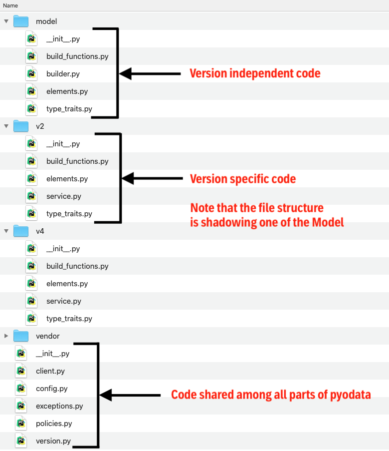

# Table of content

1. [Code separation into multiple files](#Structure)
2. [Defining OData version in the code](#version-specific-code)
3. [Working with metadata and model](#Model)
4. [GeoJson optional depencency](#GeoJson)

## Code separation into multiple files  <a name="Structure"></a>
The codebase is now split into logical units. This is in contrast to the single-file approach in previous releases. 
Reasoning behind that is to make code more readable, easier to understand but mainly to allow modularity for different 
OData versions.

Root source folder, _pyodata/_, contains files that are to be used in all other parts of the library 
(e. g. config.py, exceptions.py). Folder Model contains code for parsing the OData Metadata, whereas folder Service 
contains code for consuming the OData Service. Both folders are to be used purely for OData version-independent code. 
Version dependent belongs to folders v2, v3, v4, respectively.     

 

## Handling OData version specific code  <a name="version-specific-code"></a>
Class Version defines the interface for working with different OData versions. Each definition should be the same 
throughout out the runtime, hence all methods are static and children itself can not be instantiated. Most 
important are these methods:
- `primitive_types() -> List['Typ']` is a method, which returns a list of supported primitive types in given version
- `build_functions() -> Dict[type, Callable]:` is a methods, which returns a dictionary where, Elements classes are 
used as keys and build functions are used as values.
- `annotations() -> Dict['Annotation', Callable]:` is a methods, which returns a dictionary where, Annotations classes 
are used as keys and build functions are used as values.

The last two methods are the core change of this release. They allow us to link elements classes with different build 
functions in each version of OData.

Note the type of dictionary key for builder functions. It is not a string representation of the class name but is 
rather type of the class itself. That helps us avoid magical string in the code.

Also, note that because of this design all elements which are to be used by the end-user are imported here. 
Thus, the API for end-user is simplified as he/she should only import code which is directly exposed by this module 
(e. g. pyodata.v2.XXXElement...).   

```python
class ODataVX(ODATAVersion):
    @staticmethod
    def build_functions():
        return {
            ...
            StructTypeProperty: build_struct_type_property,
            NavigationTypeProperty: build_navigation_type_property,
            ...
        }

    @staticmethod
    def primitive_types() -> List[Typ]:
        return [
            ...
            Typ('Null', 'null'),
            Typ('Edm.Binary', '', EdmDoubleQuotesEncapsulatedTypTraits()),
            Typ('Edm.Boolean', 'false', EdmBooleanTypTraits()),
            ...
        ]

    @staticmethod
    def annotations():
        return { Unit: build_unit_annotation }
```


### Version definition location
Class defining specific should be located in the `__init__.py` file in the directory, which encapsulates the rest of 
appropriate version-specific code. 

## Working with metadata and model <a name="Model"></a>
Code in the model is further separated into logical units. If any version-specific code is to be 
added into appropriate folders, it must shadow the file structure declared in the model.

- *elements.py* contains the python representation of EDM elements(e. g. Schema, StructType...)
- *type_taraits.py* contains classes describing conversions between python and JSON/XML representation of data
- *builder.py* contains single class MetadataBuilder, which purpose is to parse the XML using lxml, 
check is namespaces are valid and lastly call build Schema and return the result.
- *build_functions.py* contains code which transforms XML code into appropriate python representation. More on that in 
the next paragraph.

### Build functions
Build functions receive EDM element as etree nodes and return Python instance of a given element. In the previous release
they were implemented as from_etree methods directly in the element class, but that presented a problem as the elements 
could not be reused among different versions of OData as the XML representation can vary widely. All functions are 
prefixed with build_ followed by the element class name (e. g. `build_struct_type_property`).  

Every function must return the element instance or raise an exception. In a case, that exception is raised and appropriate 
policy is set to non-fatal function must return dummy element instance(NullType). One exception to build a function that 
do not return element are annotations builders; as annotations are not self-contained elements but rather 
descriptors to existing ones.

```python
def build_entity_type(config: Config, type_node, schema=None):
    try:
        etype = build_element(StructType, config, type_node=type_node, typ=EntityType, schema=schema)

        for proprty in type_node.xpath('edm:Key/edm:PropertyRef', namespaces=config.namespaces):
            etype._key.append(etype.proprty(proprty.get('Name')))

        ...

        return etype
    except (PyODataParserError, AttributeError) as ex:
        config.err_policy(ParserError.ENTITY_TYPE).resolve(ex)
        return NullType(type_node.get('Name'))
```      

### Building an element from metadata 
In the file model/elements.py, there is helper function build_element, which makes it easier to build element; 
rather than manually checking the OData version and then searching build_functions dictionary, we can pass the class type, 
config instance and lastly kwargs(etree node, schema etc...). The function then will call appropriate build function 
based on OData version declared in config witch the config and kwargs as arguments and then return the result. 
```Python 
build_element(EntitySet, config, entity_set_node=entity_set)
```      

## GeoJson optional depencency  <a name="GeoJson"></a>
OData V4 introduced support for multiple standardized geolocation types. To use them GeoJson depencency is required, but
as it is likely that not everyone will use these types the depencency is optional and stored in requirments-optional.txt  


// Author note: Should be StrucType removed from the definition of build_functions? 
